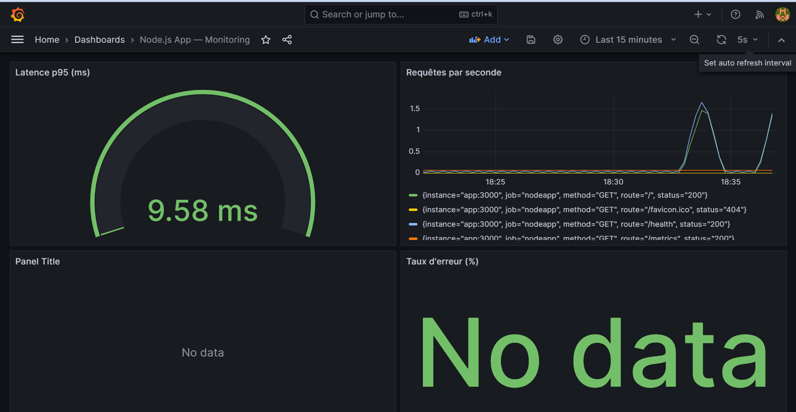
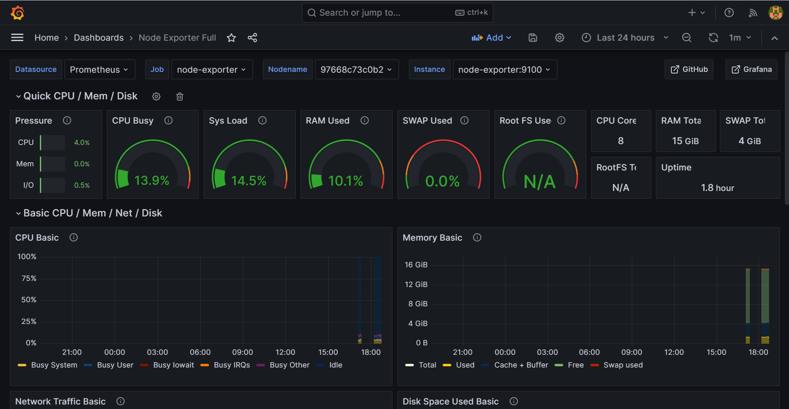

## 📊 Preuves de fonctionnement (Monitoring Grafana)

Voici les résultats de l'intégration de Prometheus et Grafana pour la surveillance de l'application et du système :

### 1. Dashboard de l'application Node.js

### 2. Dashboard Node Exporter (Métriques système)

